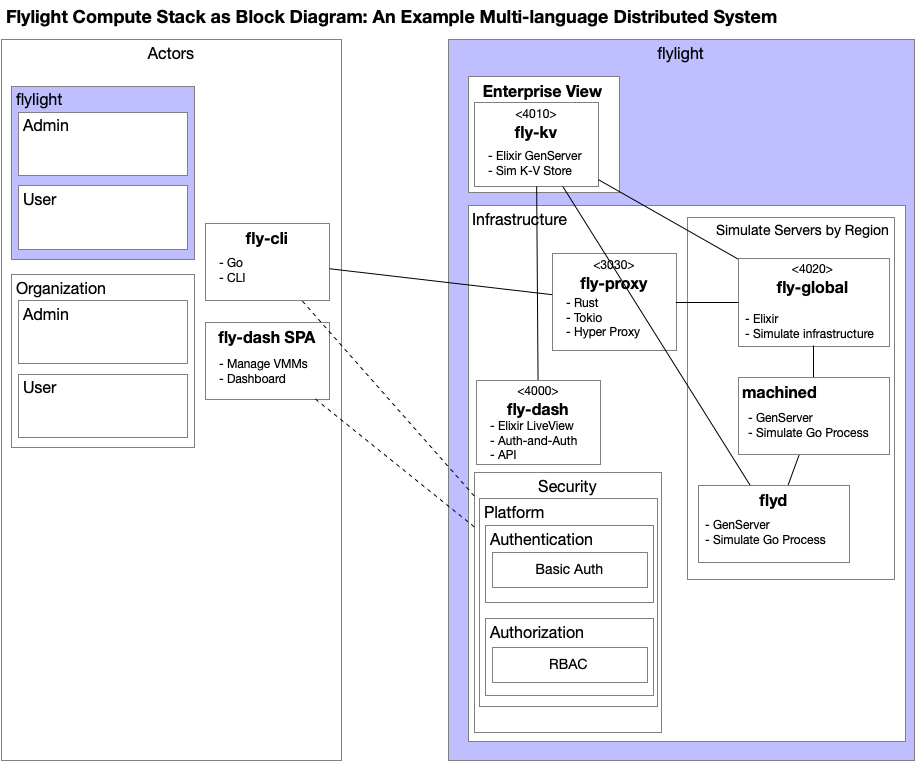

# Flylight

## TL;DR
A summary description of the `fly-light` monorepo.

### fly-light as Monorepo

-`fly-light` is a monorepo hosting multiple collaborating projects.
  - `ex_scratch`, a mix project to work out Elixir related questions.
  - `go-scratch`, a Go project to work out Go related questions.
  - `rust-scratch`, a Rust project to work out Rust related questions.
  - `fly-cli`, a Go CLI project.
  - `fly-proxy`, a Rust project providing proxy services.
  - `fly_global`, a mix project providing business orchestration services to simulate server resources.
  - `fly_kv`, a mix project providing an ephemeral key-value store in the spirit of Hashicorp's Consul key-value store.
  - `fly_dash`, a mix project providing Phoenix LiveView dashboard view of regions and machines.

## Learning Modern Distributed System Skills by Emulating fly.io

In this era of AI-generated code, including fly.io's `Phoenix.new`, it is a relevant question to ask: as a fullstack engineer, what should I know?  

Flylight asserts that distributed web architecture by way of key web languages Go, Rust, and Elixir are a good place to begin--these languages are key to the success of fly.io, an important player in the Cloud for quickly and easily enabling global services--from the command line.

Initially, this effort will focus on getting acquainted with Go and Rust and growing my understanding of Elixir, especially as it relates to OTP and LiveView.

# fly.io as Reference (Distributed) Architecture

**An elided sketch of the fly.io ecosystem.**

Flylight creates a single thread through this larger ecosystem, conveniently bending its shape to suit my desires and avoiding the hard stuff for now while getting acquainted with Go and Rust.

## Flylight Exercise
fly.io leverages **Go**, **Rust**, and **Elixir** programming languages extensively.  For purposes of this exercise, applications built with these languages are depicted in the following diagram.

This simplified topology is my mental model for the operational services that enable fly.io.  While it may be incorrect, it serves my purposes to learn something useful about a modern distributed architecture.  

The lines represent communication between applications.  
- Solid lines represent application communication that is implemented here as an architectural thread.
- Broken lines are in the backlog.

## Flylight Applications

### fly-cli
**fly-cli** is a `Go` implementation of a CLI.  This is the primary application that lives in the client or subscriber's world and its' name had to be changed so that it would not conflict with the fly.io `flyctl` application installed locally.  **This implementation is a first cut at using Go and does not represent the fly.io implementation**.  

Currently there are two commands that can be issued from `fly-cli`, 
- `./fly-cli regions` 
  - Returns all of the regions managed by fly.io.
- `./fly-cli --vm-region SIN --vm-memory 6 --vm-cores 4` 
  - This command asks for a `machine` or `VM` to be allocated in the Singapore region that has 6GB of memory and four cores.
  - As I understand it, the fly.io allocation process will find and start the machine in the time that the request-response takes to run, which is the same latency as a normal request-response.

### fly-proxy
**fly-proxy** is a `Rust` application that provides access to internal processes and resources.  This simple implementation knows where to delegate processing to internally while providing a first line of defense against malicious or non-sensical requests.  

The current example **validates the region** passed in as an option on the request.  

In the **backlog**, for learning sake, the proxy is candidate to provide the following services: 
- **Gatekeeping** by way of token validation, authentication and authorization, 
- **SSL and TLS termination**, traffic decryption, centralization of cryptographic complexity,
- **Load balancing**, health checks, removing failing nodes,
- **Request/Response Transformation**, header manipulation, and protocol translation.
- **Caching** and other techniques to reduce backend load.
- **Basic Observability**, gather metics and emit structured logs.
- **Failover and Circuit Breaking**, help to prevent cascading failures.

`Rust` is a good choice for to handle these wide ranging proxy features.

### fly-global
**fly-global** is an Elixir application that simulates global infrastructure represented by three OTP GenServers: `Infrastructure`, `MachineD`, and `FlyD`.  `Infrastructure`'s job is to obtain region and machine data from the `fly-kv` key-value store and instantiate a `MachineD` and `FlyD` process for each region-machine pair, registering each process for lookup by way of via-tuple and Registry.  `MachineD` represents a physical machine, tracking resources and taking requests for `VM allocation`, notifying `FlyD` asynchronously when a VM is allocated.  `FlyD` has the job of waking up on a configurable basis, conflating notifications into a single request and updating `fly-kv` with the allocation information.  

`fly-global` is effectively an orchestration service of collaborating processes, made resilient in a dynamic supervisor tree, allocating resources from infrastructure on a region-machine basis based on requests from `fly-cli`.

### fly-kv
**fly-kv** is the placeholder for the Hashicorp Consul key-value store that is specially designed to track device status.  In this case it is an OTP GenServer called `Store` that bootstraps a data-structure of regions and their machines from a CSV file.  `fly-kv` serves as the heart of the architecture, providing data services that include finding machines for a region that likely have availability based on allocation request, shuffling the result so that machines are allocated as randomly as possible.  These candidates are asked for from the `fly-global` orchestration service, who then asks each identified `MachineD` whether it can host the requested VM.  This continues until a MachineD is found to be available.  The resulting allocation is asynchronously fed back to the `fly-kv` application by way of `FlyD`.  

### fly-dash
**fly-dash** is a LiveView SPA that lists all of the regions and displays machines in the region when the region is selected.  The machines that are allocated indicate this by changing the status of the machine and showing machine resources in a different color, providing touch-less visual indicators of machine allocation. The synchronization between `fly-kv` and `fly-dash` is performed over distributed PubSub enabled by Phoenix's default `Phoenix.PubSub.PG2` process group clustering enabled by Erlang.

**FlyDash Dashboard**

## Interaction Diagrams
For purposes of understanding how these Flylight applications interact, these interaction diagrams are intended to be more precise than a UML Communication Diagram, but less precise than a UML Sequence Diagram--they represent a high-level sketch to help navigate this repository.

**GET `regions`**

This first interaction diagram depicts a simple traversal of distributed applications in order to get a current list of regions.  This information can help compose more complex CLI invocations, such as `launch and allocate`.

**POST `launch and allocate`**

Key points to make about `launch and allocate` include:
- Domain or business logic is performed behind the expected protection of a proxy service.
- `fly-kv` is used to provide the asked for number of candidate machines that might be able to allocate the request.
- When a machine is able to allocate adequate resources and launch the VM it asynchronously notifies `FlyD`.
- The returned `allocated machine` is launched and ready for use (a fly.io distinguishing feature).
- `FlyD` asynchronously processes all of the allocations for the machine by conflating them into a single request that is used to update `fly-kv`.
- The `kv-store`, called `Store` in the code, asynchrously publishes the change to a PubSub topic.
- The PubSub topic is updated to the LiveView SPA for dashboard display.
